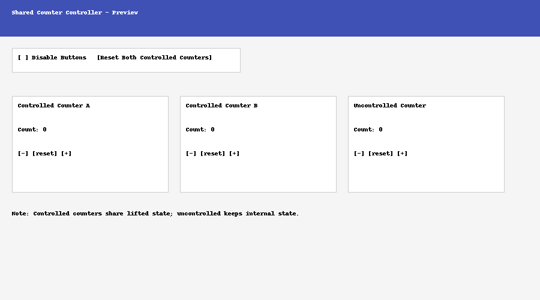

# Shared Counter Controller (React)

This React project demonstrates **state lifting**, **controlled vs. uncontrolled components**, and a **parent-level control** to disable all counter buttons.

## Features
- **`CounterDisplay.jsx`** — Displays the current count with a label.
- **`CounterControls.jsx`** — Contains `+`, `–`, and `reset` buttons.
- **State Lifting** — Counter state is moved to `App.jsx` and passed down as props.
- **Two Independent Controlled Counters** — Both share the same structure but manage different states in the parent.
- **Uncontrolled Counter** — Keeps its own `useState` internally to compare behavior.
- **Bonus Feature** — A “Disable Buttons” checkbox in the parent disables all counter controls (both controlled and uncontrolled).

## Project Structure
```
shared-counter-controller/
├── index.html
├── package.json
├── README.md
└── src/
    ├── App.jsx
    ├── CounterDisplay.jsx
    ├── CounterControls.jsx
    ├── UncontrolledCounter.jsx
    └── main.jsx
```

## Screenshot Preview



*Example layout:*
- **Top section** — Disable checkbox and "Reset Both" button.
- **Middle section** — Two controlled counters and one uncontrolled counter in cards.
- **Footer** — Notes about the demo.

## Getting Started

### 1. Install dependencies
```bash
npm install
```

### 2. Run in development mode
```bash
npm run dev
```
Then open the local URL printed in the terminal.

### 3. Build for production
```bash
npm run build
npm run preview
```

## How It Works
- **Controlled Counters**: `App.jsx` owns the state (`useState`) and passes `count` and event handlers (`onIncrement`, `onDecrement`, `onReset`) to child components.
- **Uncontrolled Counter**: Keeps its own state internally but still accepts a `disabled` prop from the parent.
- **Disable Buttons**: Toggling the checkbox in `App.jsx` sets `disabled` to `true` for all counter components, preventing interaction.
